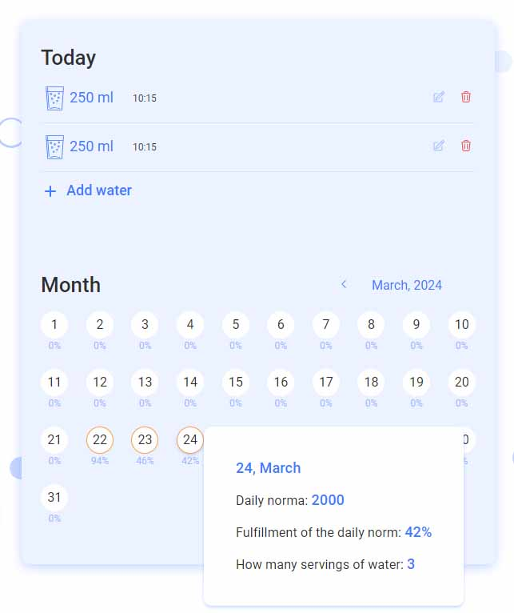
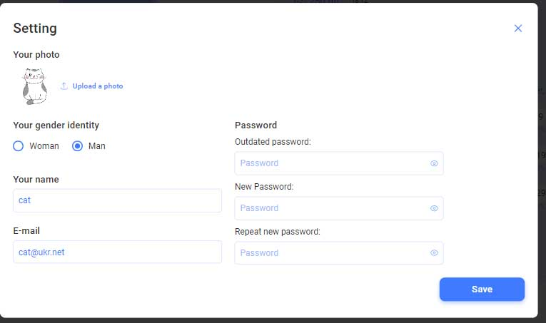

<h1 align="center"> 👨‍💻 TRACK OF WATER  👩‍💻 </h1>

&nbsp;
&nbsp;
&nbsp;
&nbsp;
&nbsp;
&nbsp;
&nbsp;
&nbsp;
&nbsp;
&nbsp;
&nbsp;
&nbsp;
&nbsp;

## <h3 align="center"> ℹ️ Capybara-component team <h3>

## Description

Water Tracker is a web application that allows users to monitor their daily
water intake. The application consists of the following functional components:
Welcome page, Home page, Water Journal, and Settings.

## Features

- Home Page: Provides an overview of the application and quick access to other
  features. 

- Water Journal: Allows users to record their water consumption throughout the
  day. 
- Settings: Enables users to customize their profile, including adding a photo,
  specifying gender, name, and updating password or email.
  

## Platform Compatibility

The application is designed to be responsive and adaptable to desktop, tablet,
and mobile devices. It has three breakpoints: 1440 pixels, 768 pixels, and 320
pixels respectively.

## User Authentication

Water Tracker includes user registration, login, and password recovery
functionalities to ensure user privacy and security.

## Customization

Users can input their personal information in the Settings section. This
includes adding a photo, specifying gender, name, and updating password or
email.

## Water Intake Tracking

Users can log their water intake manually or set a daily water intake goal. The
application suggests a recommended water intake based on user weight, but users
can also set their own target.

## Statistics and Progress

Users can view their water consumption statistics for the month in a calendar
view. Additionally, a progress panel shows the user's water intake progress for
the current day.

## Aim of the project

The primary objectives of this team project were to learn how to effectively
work in a team, apply our previously acquired skills, and successfully operate
within a specified 14-day time frame.

## Task management

✅ Yuliia Zaritska - Team Leader Frontend ◼ Setting up repository and common
styles ◼ Water rate panel functionality ◼ Codereview

✅ Andrii Sauliak - Team Leader Backend ◼ Database ◼ Swagger ◼ Codereview

✅ Uliana Nadorozhna - Scrum master ◼ User authentication functionality

✅ Julia Palamarchuk - Water statistic functionality

✅ Svitlana Biruk - Update user settings functionality ◼ Codereview

✅ Marina Fridrak - Homepage functionality ◼ Global styles

✅ Mariana Skorynovych - User`s daily norma and language functionality

✅ Andrii Hryb - User logout ◼ Loader

